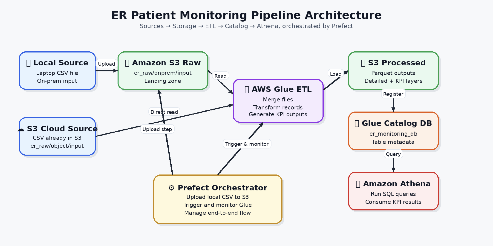

## Business Problem
Emergency departments need near real-time visibility into patient flow, waiting time, triage priority, treatment progress, and discharge status. Without a connected data pipeline, monitoring these activities becomes slow and manual, leading to delays, poor visibility, and inefficient decision-making.

## Business Need
The business needs an automated pipeline to track ER patient data and provide structured insights on:
- patient inflow
- triage urgency
- waiting time before treatment
- treatment progress
- operational reporting and analytics

## Project Objective
Build an **ER Patient Monitoring Pipeline** that ingests patient data, transforms it through an ETL workflow, and stores it in a structured cloud format for analytics. The solution uses **Amazon S3**, **AWS Glue**, **Glue Crawler**, and **Prefect** for orchestration.

## Data Architecture
The architecture (Data flow) used in this project uses different Open source and cloud components as described below:

## ETL Pipeline Explanation

This AWS Glue ETL pipeline is built for the **Emergency Room Patient Monitoring Project**. Its purpose is to read patient data from two Amazon S3 source locations, combine the datasets, transform the data, calculate important patient monitoring KPIs, and store the final output in **Parquet** format in S3.

### 1. Glue Job Initialization
The pipeline starts by initializing the AWS Glue environment using:
- **SparkContext**
- **GlueContext**
- **Spark Session**
- **Job**

This prepares the script to run as an AWS Glue ETL job.

### 2. Read Source Data from S3
The script reads two CSV files from different S3 paths:
- **On-premise source**
- **Object storage source**

These files contain emergency room patient details such as:
- patient ID
- arrival time
- triage level
- doctor assigned
- treatment start time
- discharge time

This setup simulates data coming from two different systems.

### 3. Add Source Tracking
A new column called **source_type** is added to identify the origin of each record:
- `onprem`
- `object_storage`

This helps with **data lineage** and source tracking after merging.

### 4. Merge the Datasets
Both datasets are combined into one unified patient dataset using `unionByName()`.

### 5. Convert Time Columns
The pipeline converts the following columns into timestamp format:
- `arrival_time`
- `treatment_start_time`
- `discharge_time`

This allows accurate time-based calculations.

### 6. Create Patient Status
A new column called **patient_status** is created:
- **waiting** → treatment has not started
- **under_treatment** → treatment started but discharge not completed
- **treated** → treatment and discharge completed

This shows the current stage of each patient in the ER workflow.

### 7. Calculate Waiting Time
The script calculates **waiting_time_minutes** as the difference between:
- `arrival_time`
- `treatment_start_time`

This is calculated only for patients whose treatment has started.

This is an important KPI for measuring ER efficiency.

### 8. Generate KPI Outputs
The pipeline creates the following KPI datasets:
- **ER patient count** → total number of patients
- **Average waiting time** → average waiting time in minutes
- **Severity-wise summary** → patient count by triage level
- **Treated vs waiting report** → count of waiting, under-treatment, and treated patients

These KPIs help monitor patient flow and emergency room performance.

### 9. Write Processed Data to S3
The transformed detailed dataset is stored in Amazon S3 in **Parquet** format under the processed layer.

**Why Parquet?**
- faster for analytics
- more storage efficient than CSV
- better for querying in downstream tools

### 10. Store KPI Outputs Separately
Each KPI output is written into its own S3 folder. This makes the data:
- more organized
- easier to use for dashboards
- suitable for reporting and downstream analytics

  ## Orchestration Layer Using Prefect

After building the ETL pipeline in AWS Glue, I created an orchestration layer using **Prefect** to automate and monitor the end-to-end workflow.

The main purpose of this orchestrator is to control the pipeline execution step by step, starting from uploading the local source file to Amazon S3, triggering the AWS Glue ETL job, monitoring its execution, and finally running the AWS Glue Crawler to update the data catalog.

### Purpose of the Orchestrator
The orchestrator ensures that the pipeline runs in the correct sequence and that each step is validated before moving to the next one. This improves reliability, automation, and monitoring of the overall data pipeline.

### Workflow of the Orchestrator

#### 1. Upload Local File to Amazon S3
The first task uploads the local patient data file from the system into the required S3 input location.

This ensures that the latest source file is available in the raw data layer before the ETL job starts.

#### 2. Validate AWS Glue Job
Before starting the ETL process, the orchestrator checks whether the specified AWS Glue job exists.

This validation step helps prevent failures caused by incorrect job names or missing Glue resources.

#### 3. Start AWS Glue Job
Once validation is successful, the orchestrator triggers the AWS Glue ETL job.

The Glue job then reads the source data, performs transformations, generates KPI outputs, and writes the processed data back to Amazon S3.

#### 4. Monitor Glue Job Status
After starting the Glue job, the orchestrator continuously checks the job run status until it reaches a final state such as:
- `SUCCEEDED`
- `FAILED`
- `STOPPED`
- `TIMEOUT`

This ensures that the process is fully monitored instead of just triggering the job and ending there.

#### 5. Verify Glue Job Completion
The orchestrator confirms that the Glue job has completed successfully.

If the final state is anything other than `SUCCEEDED`, the workflow raises an error. This makes the pipeline more robust and easier to debug.

#### 6. Validate AWS Glue Crawler
After the ETL job finishes successfully, the orchestrator validates whether the required AWS Glue Crawler exists.

This step ensures that the metadata update process can run without resource-related issues.

#### 7. Start the Glue Crawler
The crawler is then triggered to scan the processed data stored in Amazon S3.

If the crawler is already running, the orchestrator skips the start step to avoid unnecessary errors.

#### 8. Monitor Crawler Completion
The orchestrator continuously checks the crawler state until it becomes `READY` and confirms that the last crawl status is `SUCCEEDED`.

This ensures that the AWS Glue Data Catalog is updated successfully after the ETL process.

### Key Features of the Prefect Orchestrator
- automates the full pipeline execution
- uploads the latest local source file to S3
- validates Glue job and crawler availability
- triggers and monitors the AWS Glue ETL job
- checks job success or failure
- triggers and monitors the Glue Crawler
- improves pipeline reliability through validation and error handling

### Outcome
With Prefect orchestration, the Emergency Room Patient Monitoring Pipeline becomes an automated end-to-end workflow. It ensures that source data is uploaded, the ETL job is executed successfully, and the processed data is cataloged properly for downstream analytics and reporting.

### Tools Used in Orchestration
- **Prefect** for workflow orchestration
- **Boto3** for interacting with AWS services
- **AWS Glue Job** for ETL execution
- **AWS Glue Crawler** for metadata cataloging
- **Amazon S3** for raw and processed data storage
